# JS/TS formatting pipeline

What `<A-=>` actually runs in a `javascript`, `javascriptreact`, `typescript`,
or `typescriptreact` buffer.

Precedence: **eslint-plugin-prettier > biome > prettier**.
Prettier is the unconditional fallback, and it is always reached through the efm
LSP client rather than being shelled out to directly.

```mermaid
flowchart TD
  key["&lt;A-=&gt; in normal mode<br/>mappings.lua:253"]
  key --> run["format.run_pipeline({ async = false })<br/>utils/format.lua:66"]

  run --> hasPipeline{"M.pipelines[vim.bo.filetype]<br/>defined?"}
  hasPipeline -- "no" --> generic["vim.lsp.buf.format with client filter:<br/>any formatting-capable LSP, and efm<br/>only if some tool has a formatCommand<br/>utils/format.lua:72"]
  hasPipeline -- "yes - js / jsx / ts / tsx<br/>all alias one entry" --> js["format.javascript.format()<br/>utils/format/javascript.lua:32"]

  js --> lsp["format_with_lsp()<br/>utils/format/javascript.lua:4"]

  lsp --> attached{"eslint LSP client<br/>attached to buffer?"}
  attached -- "no" --> toastNoEslint["toast: eslint-lsp not attached"]
  attached -- "yes" --> fixAll{"LspEslintFixAll<br/>command exists?"}
  fixAll -- "no" --> toastNoCmd["toast: missing :LspEslintFixAll<br/>from nvim-lspconfig"]
  fixAll -- "yes" --> runFixAll["run :LspEslintFixAll<br/>- eslint autofixes regardless of<br/>whether prettier is wired into it"]

  toastNoEslint --> plugin
  toastNoCmd --> plugin
  runFixAll --> plugin

  plugin{"eslint-plugin-prettier in project?<br/>node.has_package, cached in<br/>vim.b.has_eslint_plugin_prettier<br/>utils/format/eslint.lua:4"}
  plugin -- "yes - that fix-all already<br/>applied prettier" --> done(["done, return true"])
  plugin -- "no" --> biome

  biome{"biome in project?<br/>node.has_package, cached in<br/>vim.b.has_biome<br/>utils/format/biome.lua:4"}
  biome -- "yes" --> efmBiome["efm.format_with('biome',<br/>{ pipeline = 'javascript' })"]
  biome -- "no - fallback entry is<br/>detected = true" --> efmPrettier["efm.format_with('prettier',<br/>{ pipeline = 'javascript' })"]

  efmBiome --> efm
  efmPrettier --> efm

  efm["efm.format_with(name)<br/>utils/format/efm.lua:71"]
  efm --> efmAttached{"efm client attached, and name<br/>registered for this ft in<br/>tools.config_with_efm_by_ft?"}
  efmAttached -- "no" --> efmFail["toast error, return false<br/>- 'Did not format with efm/NAME'"]
  efmAttached -- "yes" --> narrow["lsp.change_client_settings:<br/>temporarily narrow<br/>settings.languages[ft] to that one tool"]
  narrow --> format["synchronous vim.lsp.buf.format({ name = 'efm' })<br/>timeout 3000ms over SSH, else 1000ms<br/>utils/format/efm.lua:57"]
  format --> restore["restore original efm settings"]
  restore --> done
```

## Files

| File | Role |
| --- | --- |
| `lua/dko/mappings.lua` | binds `<A-=>` to `run_pipeline` |
| `lua/dko/utils/format.lua` | per-filetype pipeline table; generic `vim.lsp.buf.format` fallback |
| `lua/dko/utils/format/javascript.lua` | the formatter decision for js/jsx/ts/tsx |
| `lua/dko/utils/format/eslint.lua` | `eslint-plugin-prettier` detection |
| `lua/dko/utils/format/biome.lua` | `biome` detection |
| `lua/dko/utils/format/efm.lua` | runs one named efm tool, with settings narrowed and restored |
| `lua/dko/tools/javascript-typescript.lua` | registers `prettier` and `biome` as efm tools for the jsts filetypes |
| `lua/dko/tools/prettier.lua` | efm config, from `efmls-configs.formatters.prettier` |
