# JS/TS formatting pipeline

What `<A-=>` actually runs in a `javascript`, `javascriptreact`, `typescript`,
or `typescriptreact` buffer.

Precedence: **oxfmt > eslint-plugin-prettier > biome > prettier**.
eslint's fix-all runs first in every case, for its non-formatting autofixes.
oxfmt runs as its own LSP client (`oxfmt --lsp`, via nvim-lspconfig's `lsp/oxfmt.lua`);
prettier and biome run through the efm LSP; prettier is the unconditional fallback.

## Detecting oxfmt: the attached client *is* the detection

nvim-lspconfig's `oxfmt` config resolves `root_dir` by walking up from the buffer for
`.oxfmtrc.json`, `.oxfmtrc.jsonc`, `oxfmt.config.ts`,
a `package.json` matching `oxfmt`/`vite-plus`,
or a `vite.config.ts` containing `vite-plus` + `fmt:`,
and its `cmd` prefers `<root_dir>/node_modules/.bin/oxfmt` over a global `oxfmt`.
So a client exists only where the project opted into oxfmt —
no `package.json` read, no upward `vim.fs.find`, nothing to cache per format,
unlike the `vim.b.has_biome` / `vim.b.has_eslint_plugin_prettier` probes behind it.

That only holds because `after/lsp/oxfmt.lua` sets `workspace_required = true`:
upstream's `root_dir` calls `on_dir(nil)` on a miss rather than not calling it,
which would otherwise start oxfmt in single-file mode in every project.
It also narrows `filetypes` to jsts and sets `vim.b.formatter = "oxfmt"` on attach,
so the heirline winbar names oxfmt alone instead of listing every attached client
(cleared again by the `LspDetach` handler in `lua/dko/behaviors/lsp.lua`).

Known gaps:
upstream's markers omit `oxfmt.config.mts`, so a project configured solely by that file
won't attach;
and `oxfmt --lsp` answers a formatting request that beats its own `didOpen` with no edits
at all (a ~50ms window right after attach), so `format/oxfmt.lua` asks a second time when
the first request changed nothing, once per buffer.

## Waiting out LSP startup

Because availability is decided by which clients are attached,
formatting during startup would pick the wrong formatter —
or, with `eslint-plugin-prettier` in the project, silently format nothing,
since `format_with_lsp` reports success from a `package.json` check rather than from eslint
having run.
So `run_pipeline` starts by blocking on `format.wait_for_clients()`:

- if nothing is attached yet but some enabled config claims this filetype,
  wait up to 1s for a first client (a config whose `root_dir` never resolves is
  indistinguishable from one still deciding, so this only applies when nothing attached);
- then wait up to 5s while any attached client is still initializing.
  `vim.lsp.get_clients` hides those unless asked with `_uninitialized`;
- `CTRL-C` aborts the whole pipeline, and a timeout formats anyway with a WARN naming
  whatever is still starting.

It costs nothing once everything is up (measured 0ms), and nothing at all in a buffer no
enabled config claims.

While it blocks, `vim.b.dko_format_waiting` is set and the winbar turns orange
(`dkoLineImportant`, the colorscheme's running-job group), forced over the child
components so the whole bar changes, not just the gaps.
Both that and the message are `nvim_echo`'d/redrawn *before* `vim.wait` takes the loop —
nothing repaints until the wait is over, and fidget can't toast at all in that window.

```mermaid
flowchart TD
  key["&lt;A-=&gt; in normal mode<br/>mappings.lua:253"]
  key --> run["format.run_pipeline({ async = false })<br/>also every save, via BufWritePre<br/>utils/format.lua:161"]

  run --> wait{"any client attached to the buffer<br/>still initializing?<br/>format.wait_for_clients()<br/>utils/format.lua:106"}
  wait -- "yes - block the UI until they<br/>initialize, 5s cap, WARN on timeout" --> hasPipeline
  wait -- "no" --> hasPipeline
  wait -- "CTRL-C" --> abort(["abort, format nothing"])

  hasPipeline{"M.pipelines[vim.bo.filetype]<br/>defined?"}
  hasPipeline -- "no" --> generic["vim.lsp.buf.format with client filter:<br/>any formatting-capable LSP, and efm<br/>only if some tool has a formatCommand<br/>utils/format.lua:174"]
  hasPipeline -- "yes - js / jsx / ts / tsx<br/>all alias one entry" --> js["format.javascript.format()<br/>utils/format/javascript.lua:32"]

  js --> lsp["format_with_lsp()<br/>utils/format/javascript.lua:4"]

  lsp --> attached{"eslint LSP client<br/>attached to buffer?"}
  attached -- "no" --> toastNoEslint["toast: eslint-lsp not attached"]
  attached -- "yes" --> fixAll{"LspEslintFixAll<br/>command exists?"}
  fixAll -- "no" --> toastNoCmd["toast: missing :LspEslintFixAll<br/>from nvim-lspconfig"]
  fixAll -- "yes" --> runFixAll["run :LspEslintFixAll<br/>- lint autofixes land even when<br/>oxfmt does the formatting"]

  toastNoEslint --> oxfmt
  toastNoCmd --> oxfmt
  runFixAll --> oxfmt

  oxfmt{"oxfmt LSP client attached,<br/>with textDocument/formatting?<br/>utils/format/oxfmt.lua:8"}
  oxfmt -- "yes" --> oxfmtFormat["vim.lsp.buf.format({ name = 'oxfmt' })<br/>sync, SSH-aware timeout, asked twice on<br/>a buffer's first format if nothing changed<br/>utils/format/oxfmt.lua:27"]
  oxfmtFormat --> done(["done, return true"])
  oxfmt -- "no" --> plugin

  plugin{"eslint-plugin-prettier in project?<br/>node.has_package, cached in<br/>vim.b.has_eslint_plugin_prettier<br/>utils/format/eslint.lua:4"}
  plugin -- "yes - that fix-all already<br/>applied prettier" --> done
  plugin -- "no" --> biome

  biome{"biome in project?<br/>node.has_package, cached in<br/>vim.b.has_biome<br/>utils/format/biome.lua:4"}
  biome -- "yes" --> efmBiome["efm.format_with('biome',<br/>{ pipeline = 'javascript' })"]
  biome -- "no - fallback entry is<br/>detected = true" --> efmPrettier["efm.format_with('prettier',<br/>{ pipeline = 'javascript' })"]

  efmBiome --> efm
  efmPrettier --> efm

  efm["efm.format_with(name)<br/>utils/format/efm.lua:71"]
  efm --> efmAttached{"efm client attached, and name<br/>registered for this ft in<br/>tools.config_with_efm_by_ft?"}
  efmAttached -- "no" --> efmFail["toast error, return false<br/>- 'Did not format with efm/NAME'"]
  efmAttached -- "yes" --> narrow["lsp.change_client_settings:<br/>temporarily narrow<br/>settings.languages[ft] to that one tool"]
  narrow --> format["synchronous vim.lsp.buf.format({ name = 'efm' })<br/>format.timeout_ms(): 3000ms over SSH, else 1000ms"]
  format --> restore["restore original efm settings"]
  restore --> done
```

## Files

| File | Role |
| --- | --- |
| `lua/dko/mappings.lua` | binds `<A-=>` to `run_pipeline` |
| `lua/dko/utils/format.lua` | per-filetype pipeline table; `wait_for_clients()`; `timeout_ms()`; generic `vim.lsp.buf.format` fallback |
| `lua/dko/utils/format/javascript.lua` | the formatter decision for js/jsx/ts/tsx |
| `lua/dko/utils/format/oxfmt.lua` | attached-client check, and the oxfmt LSP format call |
| `after/lsp/oxfmt.lua` | narrows oxfmt to jsts, `workspace_required`, winbar label |
| `lua/dko/utils/format/eslint.lua` | `eslint-plugin-prettier` detection |
| `lua/dko/utils/format/biome.lua` | `biome` detection |
| `lua/dko/utils/format/efm.lua` | runs one named efm tool, with settings narrowed and restored |
| `lua/dko/heirline/winbar.lua` | paints the bar orange while `wait_for_clients()` blocks |
| `lua/dko/tools/javascript-typescript.lua` | registers `oxfmt` (lspconfig) and `prettier`/`biome` (efm) for the jsts filetypes |
| `lua/dko/tools/prettier.lua` | efm config, from `efmls-configs.formatters.prettier` |
